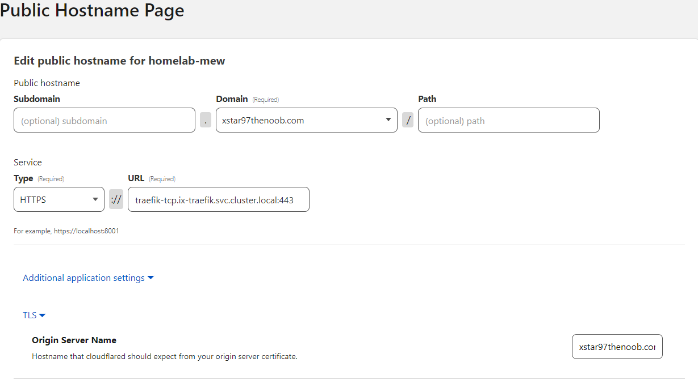

# Community CloudFlared Traefik Guide

:::caution

Implementing this guide will publicly expose your server, use at your own risk.

:::

To add **traefik** to the CloudFlared tunnel.

Create two public hostname entries in this order:

- The Root Domain
- The Wildcard Sub Domain

These are the values that would be needed and assumes that the app is named `traefik` and the port is set to `443`.

**type**: `https`

**url**: `traefik-tcp.ix-traefik.svc.cluster.local:443`

- **Additional application settings**
  - **TLS**
    - **Origin Server Name**: `mydomain.tld`

## The WildCard CNAME

:::note

When adding the sub hostname "**\***", it won't create the dns record automatically.

:::

Manually create a new CNAME record for `*` and then copy and paste the contents of the root domain's CNAME target value `XXXX..cfargotunnel.com` to the new DNS record.

## Traefik MiddleWares

It's highly advise to add a few MiddleWares like `auth` and `ipWhiteList` to protect certain apps from being directly or indirectly exposed publicly.

### IpWhiteList

To make this work, you need to locally resolve your domain with a dns server.

Add your own lan range and the kubernetes `172.16.0.0/12` which encompasses the entire kubernetes range.

Edit the app you want to add this middleware and give it the same name, for example `local`.

### Auth

Adding an authentication middleware in Traefik can provide several benefits:

Security: It can protect sensitive information and resources by requiring users to provide valid credentials before accessing them.

User management: It can enable you to manage user accounts, define access rights, and restrict access to certain parts of your system.

Data protection: By controlling who can access certain data, you can help to ensure that it is kept confidential and secure.

Traceability: By tracking which users have accessed what resources, you can keep a record of who has done what, making it easier to understand how your system is being used.

Convenience: By using a centralized authentication system, you can reduce the amount of work required to implement authentication for each service, making it easier to manage and maintain.

Here's a non exhaustive list of various auth methods available.

- [Authelia](<https://www.youtube.com/watch?v=cmMm5keX1vk&t=1s>)
- [Authentik](<https://truecharts.org/charts/stable/authentik/how_to>)
- [Organizr](<https://truecharts.org/charts/stable/organizr/forward_auth>)
- [Basic](<https://truecharts.org/charts/enterprise/traefik/traefik-basicAuth-middleware>)
